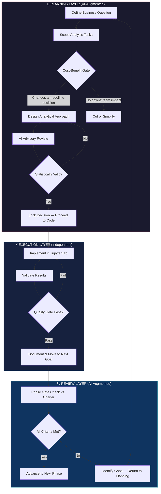

## AI-Augmented Planning Methodology

This project was built using a **structured AI advisory workflow** — not as a code-generation shortcut, but as a planning and decision-quality amplifier. Every phase followed a Research-Before-Code Protocol where Claude (Anthropic) served as a technical advisor for scoping, cost-benefit triage, and analytical design review.

### Why This Matters

Most data science portfolios demonstrate technical execution. This project additionally demonstrates **the ability to orchestrate AI as a force multiplier** — a skill that Big 4 firms and enterprise teams are actively building into their consulting workflows. The methodology shown here mirrors how Deloitte and McKinsey engagement teams use AI advisory tools in discovery and analysis phases.

### The Workflow

The AI advisory loop operated at the **planning layer**, not the implementation layer. Code was written independently in JupyterLab; Claude was consulted for:

| Advisory Function | What This Looked Like |
|---|---|
| **Scope & Cost-Benefit Triage** | Before each analysis task: *"Does this change a downstream modelling decision? If not, cut it."* |
| **Analytical Design Review** | Feature engineering decisions reviewed against statistical validity before implementation |
| **Risk Identification** | Data limitations surfaced early (e.g., returns attribution gap) rather than discovered mid-modelling |
| **Quality Gate Verification** | Each phase gate checked against charter criteria with pass/fail assessment |

### Concrete Impact: Decisions Shaped by AI Advisory

These are real examples where the structured advisory process changed project outcomes:

**1. Feature Pruning — MonetaryTrend Dropped**
- *Initial plan:* Include monetary trend (slope of order value over time) as a behavioural dynamics feature.
- *Advisory finding:* Median customer has only 3–5 orders. Running `linregress` on 3 data points produces statistically meaningless slopes with high variance.
- *Decision:* Feature dropped. Saved modelling time and prevented noise injection into downstream models.

**2. Returns Attribution Gap — Early Discovery**
- *Initial plan:* Compute per-customer return rate and net revenue as core features.
- *Advisory finding:* All negative-Quantity rows (returns/cancellations) have null CustomerIDs. Returns cannot be attributed to specific customers at the individual level.
- *Decision:* ReturnRate and NetRevenue dropped from the customer feature set. Analysis pivoted to transaction-level returns profiling instead of forcing an uncomputable metric.

**3. Wholesale vs. Retail Split — Elevated to Critical Axis**
- *Initial plan:* Treat all customers uniformly; flag wholesale as a minor data note.
- *Advisory finding:* Bimodal invoice revenue distribution confirmed statistically. B2B customers dominate averages and confound every downstream model if undetected.
- *Decision:* Wholesale/retail distinction became a primary segmentation axis, not a footnote.

**4. Academic Padding Eliminated**
- Multiple planned analyses were cut after cost-benefit review determined they would not change any modelling decision. The advisory process consistently asked: *"What would you do differently if this analysis showed X vs. Y?"* If the answer was "nothing," the task was cut or simplified.

### What I Controlled vs. What the AI Advised

| Layer | Owner | AI Role |
|---|---|---|
| All code implementation | Me (JupyterLab) | None — zero code generation used |
| Final decisions on scope, features, methodology | Me | Advisory input evaluated critically |
| Planning documents (charter, DA goals) | Me (authored) | Iterative review to senior DS standard |
| Statistical test selection and interpretation | Me (executed) | Methodology options surfaced for evaluation |
| Business narrative and write-ups | Me | Structural feedback on clarity and rigour |

### Methodology Diagram

### Key Takeaway

The value of AI in this project was not in writing code — it was in **raising the quality ceiling of planning decisions**. The Research-Before-Code Protocol, combined with structured AI advisory, produced a project with consulting-grade documentation, statistically grounded feature decisions, and zero wasted analytical effort. This is the same capability that enterprise teams are building today.
