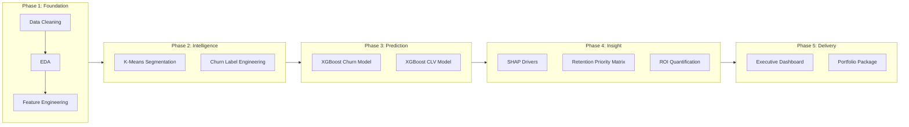
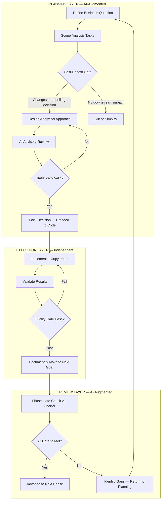

# CIRPA-2026-S1

## Customer Intelligence & Predictive Retention Analytics Engine

A full-lifecycle customer analytics pipeline that segments an e-commerce retailer's customer base, predicts individual churn probability and lifetime value, diagnoses the drivers of attrition, and produces prioritised retention recommendations with quantified financial impact.

**In one sentence:** Segment customers by behaviour, predict who will leave and what they are worth, explain why, and recommend what to do about it — on a repeatable schedule.

---

### The Business Problem

An e-commerce retailer has two years of granular transactional data but no analytical infrastructure to answer four critical questions:

| # | Question | Consequence of Not Answering |
|---|---|---|
| Q1 | **Who are our customers?** | All customers treated identically; marketing spend is unoptimised |
| Q2 | **Who is about to leave?** | Churn discovered only after it occurs — when intervention is too late |
| Q3 | **What are they worth?** | High-value customers under-served; resources misallocated |
| Q4 | **What should we do about it?** | Blanket campaigns waste budget on low-value or already-loyal customers |

This project delivers the analytical capability to answer all four within a single, integrated, repeatable workflow.

---

### Key Results

<!-- TODO: Fill in your actual metrics below -->

| Metric | Result |
|---|---|
| Customer segments identified | `[FILL: e.g., 4 segments]` |
| Churn prediction AUC-ROC (temporal holdout) | `[FILL: e.g., 0.83]` |
| CLV model performance | `[FILL: e.g., R² = 0.52 or classification accuracy = 0.78]` |
| Revenue concentration (Gini) | 0.716 |
| Top 1% of customers → revenue share | ~31.8% |
| Top 5% of customers → revenue share | ~50.5% |
| Churn drivers identified per segment | `[FILL: e.g., ≥5 per segment via SHAP]` |
| Retention ROI | `[FILL: e.g., £X retained per £1 spent]` |

---

### Dataset

| Attribute | Detail |
|---|---|
| Source | [UCI Online Retail II](https://archive.ics.uci.edu/dataset/502/online+retail+ii) (CC BY 4.0) |
| Origin | Real UK-based non-store online retailer; all-occasion giftware; many wholesale customers |
| Period | 01 Dec 2009 – 09 Dec 2011 |
| Raw records | ~1,067,371 transaction lines |
| Unique customers (post-cleaning) | ~4,372 |
| Countries | 38 (UK = 91.4% of transactions) |

The dataset provides 8 raw columns (Invoice, StockCode, Description, Quantity, InvoiceDate, UnitPrice, CustomerID, Country). Every feature used in modelling is engineered from these columns — no external data.

---

### Analytical Pipeline

The project follows a five-phase chain where each phase produces outputs consumed by the next, mirroring the enterprise analytics lifecycle.



#### Phase 1 — Foundation (Data Engineering & Exploration)

Seven data analysis goals, sequentially dependent, governed by binary pass/fail quality gates:

| Goal | Focus | Key Output |
|---|---|---|
| DA-1 | Data quality & cleaning | Clean dataset, missingness mechanism testing (MCAR/MAR/MNAR), data dictionary, population bias assessment |
| DA-2 | Transaction-level EDA | Seasonality decomposition, wholesale/retail breakpoint identification, price-point analysis |
| DA-3 | Customer-level feature engineering | 11 features across RFM, behavioural dynamics, volatility, temporal, and geographic dimensions |
| DA-4 | Revenue concentration | Pareto analysis, Gini coefficient, 4-tier customer value tiers, revenue-at-risk scenarios |
| DA-5 | Behavioural profiling | Hopkins statistic for clustering readiness, multimodality testing, dual-method outlier analysis |
| DA-6 | Cohort retention & churn threshold | Kaplan-Meier survival curves, churn sensitivity analysis across 5 inactivity windows |
| DA-7 | Geographic & returns deep dive | UK vs. international statistical comparison, returns impact quantification |

#### Phase 2 — Customer Intelligence

K-Means clustering on scaled behavioural features to identify distinct customer segments. Each segment profiled with business labels and validated with statistical tests (Kruskal-Wallis p < 0.05 on ≥3 dimensions). Churn defined using a data-driven inactivity threshold from DA-6 sensitivity analysis.

#### Phase 3 — Prediction

| Task | Primary Model | Baseline | Evaluation |
|---|---|---|---|
| Churn prediction | XGBoost | Logistic Regression | AUC-ROC on temporal holdout (train: Dec 2009–Jun 2011, test: Jul–Dec 2011) |
| CLV prediction | XGBoost Regressor | Ridge Regression | R² on temporal holdout; classification fallback if R² < 0.50 |

Temporal split enforced throughout — no future information leaks into training features.

#### Phase 4 — Insight & Recommendation

SHAP interpretability layer produces global feature importance, per-segment churn driver analysis (≥5 drivers per segment), and local customer-level explanations. Outputs feed a 4-tier retention priority matrix (Protect / Nurture / Monitor / Accept) with customer counts and £ values per tier. ROI quantified with stated assumptions.

#### Phase 5 — Delivery

Executive dashboard and full portfolio packaging.

---

### Feature Engineering

The final feature set (post-VIF pruning for multicollinearity):

| Feature | Definition | Category |
|---|---|---|
| Recency | Days since last purchase (relative to reference date) | RFM |
| Frequency | Distinct invoice count | RFM |
| Monetary | Total gross revenue | RFM |
| AverageRevenuePerOrder | Mean invoice value | Behavioural |
| UniqueItemsPerOrder | Mean distinct products per invoice | Behavioural |
| MonetaryVolatility | Standard deviation of order values | Volatility |
| InterPurchaseInterval | Mean days between consecutive purchases | Behavioural |
| RecencyVelocity | Recency / tenure — normalised disengagement signal | Dynamics |
| MostActiveDay | Modal day of week for purchases | Temporal |
| MostActiveMonth | Modal month for purchases | Temporal |
| IsUK | Binary UK/international flag | Geographic |

**Features dropped with documented rationale:**

| Feature | Reason |
|---|---|
| MonetaryTrend | Median 3–5 orders per customer; `linregress` slopes on ≤3 points are statistically meaningless |
| DaysSinceFirstPurchase | High multicollinearity with Recency (VIF > 10) |
| Lastdaytofirstday | Redundant with tenure-derived features |
| AvgItemsPerOrder | High correlation with UniqueItemsPerOrder |
| MostActiveHour | Near-zero variance — B2B purchasing concentrated in business hours |
| ReturnRate | All negative-Quantity rows have null CustomerIDs — returns cannot be attributed at the customer level |
| NetRevenue | Same attribution gap as ReturnRate; uncomputable per customer |

---

### Critical Data Discovery: Returns Attribution Gap

A key finding during DA-1 that shaped the entire downstream pipeline: every return/cancellation row (negative Quantity) in this dataset has a null CustomerID. This means return rate and net revenue — features planned in the original charter — are uncomputable at the customer level.

This was surfaced during the structured planning process before any modelling began, preventing the common mistake of forcing an uncomputable metric and producing misleading results. The analysis pivoted to transaction-level returns profiling instead.

---

### Technical Decisions Log

| Decision | Evidence | Impact |
|---|---|---|
| **UK-only customer filter** | UK = 91% of transactions, ~85% of revenue; statistically significant behavioural differences confirmed via Mann-Whitney U | International excluded; documented as limitation |
| **Wholesale/retail as critical axis** | Bimodal invoice revenue distribution confirmed; B2B customers dominate averages | Elevated from footnote to primary segmentation consideration |
| **Gross Monetary (not Net) as value metric** | Returns cannot be attributed to customers (null CustomerID on all return rows) | Documented overstatement risk; gross revenue used with caveat |
| **90-day churn threshold** | `[FILL: Kaplan-Meier median survival time and sensitivity analysis results]` | `[FILL: churn rate at chosen threshold]` |
| **Pareto revenue distribution** | Gini = 0.716; top 1% (~43 customers) = ~31.8% of revenue | Justified targeted retention investment for top-tier accounts |

---

## AI-Augmented Planning Methodology

This project was built using a **structured AI advisory workflow** — not as a code-generation shortcut, but as a planning and decision-quality amplifier. Every phase followed a Research-Before-Code Protocol where Claude (Anthropic) served as a technical advisor for scoping, cost-benefit triage, and analytical design review.

### Why This Matters

Most data science portfolios demonstrate technical execution. This project additionally demonstrates **the ability to orchestrate AI as a force multiplier** — a skill that Big 4 firms and enterprise teams are actively building into their consulting workflows.

### The Workflow

The AI advisory loop operated at the **planning layer**, not the implementation layer. Code was written independently in JupyterLab; Claude was consulted for:

| Advisory Function | What This Looked Like |
|---|---|
| **Scope & Cost-Benefit Triage** | Before each analysis task: *"Does this change a downstream modelling decision? If not, cut it."* |
| **Analytical Design Review** | Feature engineering decisions reviewed against statistical validity before implementation |
| **Risk Identification** | Data limitations surfaced early (e.g., returns attribution gap) rather than discovered mid-modelling |
| **Quality Gate Verification** | Each phase gate checked against charter criteria with pass/fail assessment |

### Concrete Impact: Decisions Shaped by AI Advisory

**1. Feature Pruning — MonetaryTrend Dropped**
- *Initial plan:* Include monetary trend (slope of order value over time) as a behavioural dynamics feature.
- *Advisory finding:* Median customer has only 3–5 orders. Running `linregress` on 3 data points produces statistically meaningless slopes with high variance.
- *Decision:* Feature dropped. Prevented noise injection into downstream models.

**2. Returns Attribution Gap — Early Discovery**
- *Initial plan:* Compute per-customer return rate and net revenue as core features.
- *Advisory finding:* All negative-Quantity rows have null CustomerIDs. Returns cannot be attributed at the individual level.
- *Decision:* ReturnRate and NetRevenue dropped. Analysis pivoted to transaction-level returns profiling.

**3. Wholesale vs. Retail Split — Elevated to Critical Axis**
- *Initial plan:* Treat all customers uniformly; flag wholesale as a minor note.
- *Advisory finding:* Bimodal invoice revenue distribution confirmed statistically. B2B customers confound every downstream model if undetected.
- *Decision:* Wholesale/retail distinction became a primary segmentation axis.

**4. Academic Padding Eliminated**
- Multiple planned analyses were cut after cost-benefit review. The advisory process consistently asked: *"What would you do differently if this analysis showed X vs. Y?"* If the answer was "nothing," the task was removed.

### What I Controlled vs. What the AI Advised

| Layer | Owner | AI Role |
|---|---|---|
| All code implementation | Me (JupyterLab) | None |
| Final decisions on scope, features, methodology | Me | Advisory input evaluated critically |
| Planning documents (charter, DA goals) | Me (authored) | Iterative review to senior DS standard |
| Statistical test selection and interpretation | Me (executed) | Methodology options surfaced for evaluation |
| Business narrative and write-ups | Me | Structural feedback on clarity and rigour |

### Methodology Diagram



### Key Takeaway

The value of AI in this project was not in writing code — it was in **raising the quality ceiling of planning decisions**. The Research-Before-Code Protocol produced consulting-grade documentation, statistically grounded feature decisions, and zero wasted analytical effort.

---

### Project Governance

This project was managed with a formal project charter (v3.0) including risk register, RACI matrix, WBS, and quality gates — structured to Big 4 consulting standards. Key governance artifacts:

| Document | Purpose |
|---|---|
| Project Charter v3.0 | Scope, objectives, risk register, milestone schedule, quality gate criteria |
| DA Goals v2.0 | 7 data analysis goals with 60+ required outputs, binary success criteria, reviewed to Senior DS standard |
| Feature Definition Registry | Every engineered feature with formula, business definition, expected range, and caveats |
| Data Dictionary | Every column in the clean dataset with type, definition, permitted values, and known caveats |
| Modelling Decision Log | All decisions affecting modelling with evidence references |

Quality gates are binary pass/fail — no modelling begins until every DA goal's outputs are complete. This mirrors the enterprise standard where the data quality report is a standalone deliverable sent to the client before any modelling begins.

---

### Repository Structure

```
CIRPA-2026-S1/
├── notebooks/
│   ├── 01_data_ingestion_cleaning.ipynb
│   ├── 02_exploratory_data_analysis.ipynb
│   ├── 03_feature_engineering.ipynb
│   ├── 04_segmentation.ipynb
│   ├── 05_churn_prediction.ipynb
│   ├── 06_clv_prediction.ipynb
│   ├── 07_shap_analysis.ipynb
│   └── 08_roi_quantification.ipynb
├── src/
│   ├── data_cleaning.py
│   ├── feature_engineering.py
│   ├── model_training.py
│   └── evaluation.py
├── outputs/
│   ├── segment_profiles.csv
│   ├── customer_scores.csv
│   ├── model_comparison.csv
│   └── dashboard_data.csv
├── figures/
├── docs/
│   ├── project_charter_v3.pdf
│   ├── da_goals_v2.pdf
│   ├── data_dictionary.csv
│   ├── feature_registry.csv
│   └── workflow_diagram.svg
├── README.md
├── requirements.txt
├── .gitignore
└── LICENSE
```

---

### Tech Stack

| Layer | Tools |
|---|---|
| Environment | Python 3.10+, JupyterLab, Git/GitHub |
| Data Processing | pandas, numpy |
| EDA & Statistics | matplotlib, seaborn, scipy.stats, statsmodels |
| Unsupervised ML | scikit-learn (K-Means, DBSCAN, preprocessing) |
| Supervised ML | XGBoost, scikit-learn (LogisticRegression, Ridge) |
| Class Imbalance | imbalanced-learn (SMOTE) |
| Interpretability | SHAP |
| Dashboard | `[FILL: Tableau Public / Power BI / Plotly]` |

---

### Limitations & Future Work

**Known Limitations**
- ~4,372 unique customers is a small ML sample — model stability is lower than enterprise-scale datasets. Stratified 5-fold cross-validation mitigates but does not eliminate this.
- Returns cannot be attributed to individual customers (null CustomerID on all return rows). Gross revenue is used as the monetary metric with documented overstatement risk.
- 25 months of data provides barely two annual cycles. Seasonality conclusions should be treated cautiously.
- Non-contractual setting means churn is defined by inactivity threshold, not a ground-truth event. The threshold is data-driven (sensitivity analysis) but inherently a modelling choice.
- UK-only filter excludes ~15% of revenue. International customers noted as a separate analytical track.

**Future Extensions**
- Semester 2: prescriptive optimisation layer (mathematical optimisation for campaign budget allocation)
- Market basket analysis via association rule mining (Apriori/FP-Growth) — the dataset naturally supports this
- A/B test design framework for validating retention interventions in production
- Real-time model serving via API deployment (MLOps path)

---

### How to Reproduce

```bash
git clone https://github.com/[YOUR_USERNAME]/CIRPA-2026-S1.git
cd CIRPA-2026-S1
pip install -r requirements.txt
# Run notebooks in order: 01 through 08
```

All random seeds are documented. Reference dates for temporal features are explicit. The cleaning pipeline is deterministic — same input produces identical output.

---

### Citation

Dataset: Chen, D., Sain, S.L., Guo, K. (2012). *Data mining for the online retail industry: A case study of RFM model-based customer segmentation using data mining.* Journal of Database Marketing & Customer Strategy Management, 19(3), 197–208.

---

### Licence

This project is for portfolio and educational purposes. The UCI Online Retail II dataset is licensed under [CC BY 4.0](https://creativecommons.org/licenses/by/4.0/).
